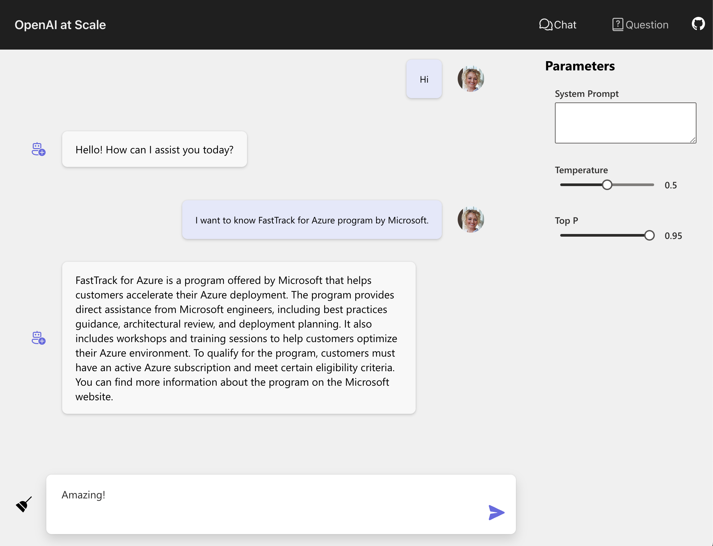

# OpenAI at Scale
> Note
This content is in early alpha stage and is subject to change.

**OpenAI at Scale** is a workshop by FastTrack for Azure team that helps customers to build and deploy simple ChatGPT UI application on Azure.




---
## Get Started
### Deploy to local environment

**Set up Python environment**
```shell
cd app
python -m venv backend/backend_env
./backend_env/bin/python -m pip install -r requirements.txt
```

**Start Frontend (React)**
```shell
cd app/frontend
npm install
npm start
```

**Start Backend (Flask)**
```shell
cd app/backend
./backend_env/bin/python ./app.py
```


### Deploy to Azure

> Under construction

## Resources

* [ChatGPT + Enterprise data with Azure OpenAI and Cognitive Search](https://github.com/Azure-Samples/azure-search-openai-demo)
    * This repo is based on this sample code.