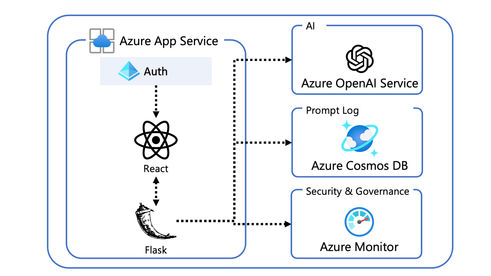

# OpenAI at Scale
>
> Note
This content is in early alpha stage and is subject to change.

**OpenAI at Scale** is a workshop by FastTrack for Azure team that helps customers to build and deploy simple ChatGPT UI application on Azure.



## Features

- Chat and Q&A interfaces
- Configure system prompts and hyperparameters
- Authenticate with Azure Active Directory
- Store logs into Cosmos DB and Log Analytics


---

## Get Started

### Creating Azure OpenAI Service

There are some way to create open ai service, we recommend to use Azure Portal if you are not familiar with Azure CLI.

Before started you need to choose a location for your service. You can find the list of available locations here -> supported location is here : [Supported locations](https://azure.microsoft.com/en-us/explore/global-infrastructure/products-by-region/?regions=all&products=cognitive-services)

- **Azure Portal** :
You can follow the [official document](https://learn.microsoft.com/en-us/azure/cognitive-services/openai/how-to/create-resource?pivots=web-portal) to create Azure OpenAI Service.
- **Azure CLI** : You can use the following command to create Azure OpenAI Service.

```shell
# Set environment variables
export SUBSCRIPTION_ID=<your subscription id>
export RESOURCE_GROUP=<your resource group name>
export LOCATION=<your location>
export OPENAI_SERVICE_NAME=<your openai service name>
export AZURE_OPENAI_CHATGPT_DEPLOYMENT=<deployment name of your gpt-35-turbo model>
```

export RESOURCE_GROUP='openai-kyoheim'
export LOCATION=eastus
export OPENAI_SERVICE_NAME=openai-kyoheim002
export AZURE_OPENAI_CHATGPT_DEPLOYMENT=kyoheim-gpt-model

```shell
az login #check your subscription id
az account set --subscription $SUBSCRIPTION_ID
az group create --name $RESOURCE_GROUP  --location $LOCATION
az cognitiveservices account create \
    --name $OPENAI_SERVICE_NAME \
    --kind OpenAI \
    --sku S0 \
    --resource-group $RESOURCE_GROUP \
    --location $LOCATION \
    --yes
az cognitiveservices account deployment create \
   -g $RESOURCE_GROUP  \
   -n $OPENAI_SERVICE_NAME \
   --deployment-name $AZURE_OPENAI_CHATGPT_DEPLOYMENT \
   --model-name gpt-35-turbo \
   --model-version "0301"  \
   --model-format OpenAI \
   --scale-settings-scale-type "Standard"
```

### Deploy to local environment

if you alrady set up your Open AI Service, you need to set up your environment variables before you spin up your app.

```shell
export RESOURCE_GROUP=<your resource group name>
export OPENAI_SERVICE_NAME=<your openai service name>
export AZURE_OPENAI_CHATGPT_DEPLOYMENT=<deployment name of your gpt-35-turbo model>
export OPENAI_API_KEY=`az cognitiveservices account keys list \
-n $OPENAI_SERVICE_NAME \
-g $RESOURCE_GROUP \
-o json \
| jq -r .key1`
export AZURE_OPENAI_SERVICE_ENDPOINT=`az cognitiveservices account show \
-n $OPENAI_SERVICE_NAME \
-g $RESOURCE_GROUP \
-o json \
| jq -r .properties.endpoint`
```

**Set up Python environment**

```shell
cd app
python -m venv backend/backend_env
./backend_env/bin/python -m pip install -r requirements.txt
```

**Start Frontend (React)**

```shell
cd app/frontend
npm install
npm run dev
```

**Start Backend (Flask)**

```shell
cd app/backend
./backend_env/bin/python ./app.py
```

### Deploy to Azure

> Under construction

## Resources

- [ChatGPT + Enterprise data with Azure OpenAI and Cognitive Search](https://github.com/Azure-Samples/azure-search-openai-demo)
  - This repo is based on this sample code.
